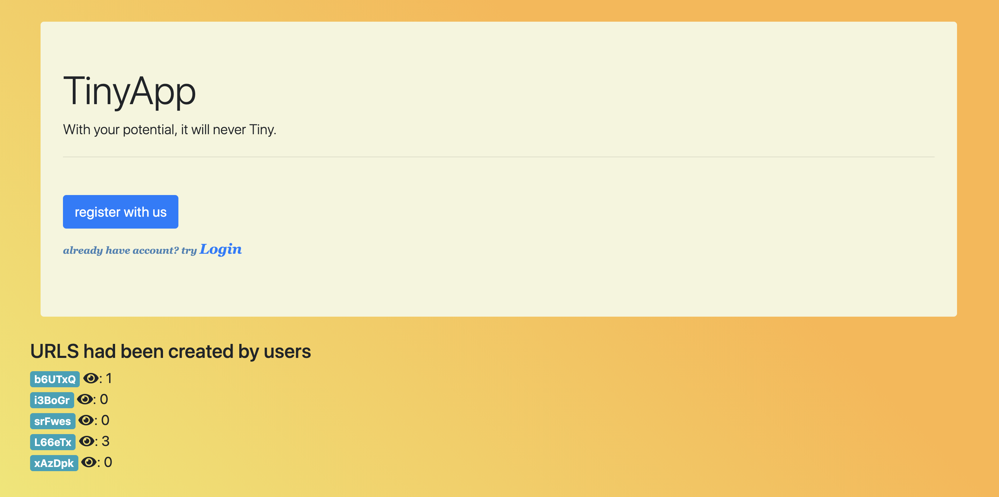
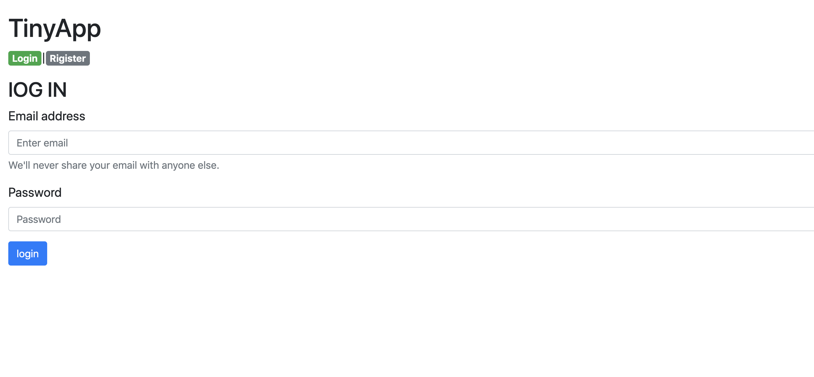
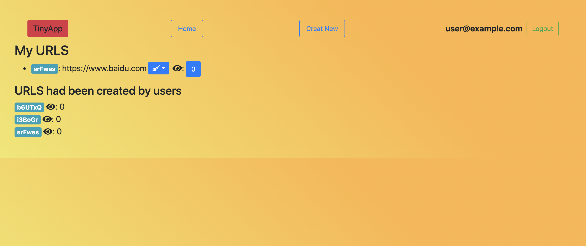

# tinyApp project
tinyAPP is a full stack application build with node and express that allow user shorten long URLs

## dependencies:
* bcrypt
* body-parser
* cookie-session
* ejs
* express
* bootstrap 

## final project




# Getting start
```
$ npm install
```
```
$ npm start
```
* Visit localhost:8081 in your browser

